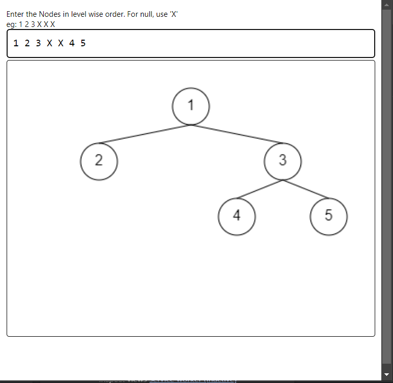

# Binary Tree Visualizer

A Chrome extension that visualizes binary trees, enabling users to interactively create and manipulate binary trees. This tool is intended to aid in the visualization of the binary tree for developers and students.

## Features

- **Interactive Visualization**: Create and visualize binary trees dynamically.
- **Educational Tool**: Ideal for DSA problem solvers.
- **User-Friendly Interface**: Simple and intuitive UI made with HTML, CSS, and JavaScript.

## Screenshots
 
### Main Interface


1. **Clone the Repository:**
    ```bash
    git clone https://github.com/mkousshik/binary_tree_visualizer.git
    ```
2. **Open Chrome and navigate to `chrome://extensions/`.**
3. **Enable "Developer mode"** by toggling the switch in the upper right corner.
4. **Click "Load unpacked"** and select the folder where you cloned the repository.

## Usage

- Open the Chrome extension by clicking on its icon.
- Use the provided controls to create and manipulate binary trees.
- Observe how the tree updates visually with each operation.

## Technologies Used

- **HTML**: Structure of the extension.
- **CSS**: Styling for the user interface.
- **JavaScript**: Logic for tree visualization and operations.

## Contributing

Contributions, issues, and feature requests are welcome!

1. Fork the project.
2. Create your feature branch (`git checkout -b feature/AmazingFeature`).
3. Commit your changes (`git commit -m 'Add some AmazingFeature'`).
4. Push to the branch (`git push origin feature/AmazingFeature`).
5. Open a pull request.

## License

No License

## Contact

*Koushik Mandal* - [mkousshik@gmail.com](mailto:mkousshik@gmail.com)

Project Link: [https://github.com/mkousshik/binary_tree_visualizer](https://github.com/mkousshik/binary_tree_visualizer)
